# FHIR Resources Analysis — Agni HeartCare Facade

> [!NOTE]
> This document catalogs every FHIR resource used in the `agni-facade-hc-on-agni` application, its implementing class, purpose, and relationships to other resources.

---

## Summary Table

| # | FHIR Resource | Class File(s) | Category | Purpose |
|---|---|---|---|---|
| 1 | **Patient** | [patient.js](./class/patient.js) | Administration | Core patient demographics |
| 2 | **Practitioner** | [practitioner.js](./class/practitioner.js) | Administration | Healthcare provider information |
| 3 | **PractitionerRole** | [practitionerRole.js](./class/practitionerRole.js) | Administration | Role assignment of practitioner within organization |
| 4 | **Organization** | [Organization.js](./class/Organization.js), [HealthFacilityOrganization.js](./class/HealthFacilityOrganization.js) | Administration | Health facilities & organizational hierarchy |
| 5 | **Location** | [LevelLocation.js](./class/LevelLocation.js), [location.js](./class/location.js) | Administration | Administrative divisions (islands, atolls, etc.) |
| 6 | **RelatedPerson** | [relatedPerson.js](./class/relatedPerson.js) | Administration | Patient family relationships |
| 7 | **Encounter** | [BaseEncounter.js](./class/BaseEncounter.js), [CVDEncounter.js](./class/CVDEncounter.js), [DispenseEncounter.js](./class/DispenseEncounter.js), [GroupEncounter.js](./class/GroupEncounter.js), + domain-specific | Clinical | Patient visits, consultations, and sub-encounters |
| 8 | **Appointment** | [Appointment.js](./class/Appointment.js) | Scheduling | Patient appointment scheduling |
| 9 | **Schedule** | [Schedule.js](./class/Schedule.js) | Scheduling | Practitioner availability schedule |
| 10 | **Slot** | [Slot.js](./class/Slot.js) | Scheduling | Individual time slots within a schedule |
| 11 | **Observation** | [BaseObservation.js](./class/BaseObservation.js), [VitalObservation.js](./class/VitalObservation.js), [CVDObservation.js](./class/CVDObservation.js), [symptomObservation.js](./class/symptomObservation.js) | Clinical | Vitals, symptoms, CVD risk assessment |
| 12 | **Condition** | [Condition.js](./class/Condition.js), [PriorDxCondition.js](./class/PriorDxCondition.js) | Clinical | Diagnoses & prior medical conditions |
| 13 | **AllergyIntolerance** | [AllergyIntolerance.js](./class/AllergyIntolerance.js) | Clinical | Patient allergy records |
| 14 | **Medication** | [medication.js](./class/medication.js) | Medication | Drug master data |
| 15 | **MedicationKnowledge** | [MedicationKnowledge.js](./class/MedicationKnowledge.js) | Medication | Drug classification & brand information |
| 16 | **MedicationRequest** | [MedicationRequest.js](./class/MedicationRequest.js) | Medication | Prescriptions |
| 17 | **MedicationDispense** | [MedicationDispense.js](./class/MedicationDispense.js) | Medication | Drug dispensing records |
| 18 | **Immunization** | [Immunization.js](./class/Immunization.js) | Clinical | Vaccination records |
| 19 | **ImmunizationRecommendation** | [ImmunizationRecommendation.js](./class/ImmunizationRecommendation.js) | Clinical | Recommended vaccination schedule |
| 20 | **ServiceRequest** | [ServiceRequest.js](./class/ServiceRequest.js), [ReferralServiceRequest.js](./class/ReferralServiceRequest.js) | Clinical | Interventions & patient referrals |
| 21 | **ActivityDefinition** | [InterventionActivityDefinition.js](./class/InterventionActivityDefinition.js), [TestExamActivityDefinition.js](./class/TestExamActivityDefinition.js) | Clinical | Intervention & test/exam master definitions |
| 22 | **DiagnosticReport** | [DiagnosticReport.js](./class/DiagnosticReport.js) | Reporting | Lab report metadata |
| 23 | **DocumentManifest** | [DocumentManifest.js](./class/DocumentManifest.js) | Reporting | Medical record document grouping |
| 24 | **DocumentReference** | [BaseDocumentReference.js](./class/BaseDocumentReference.js), [LabDocumentReference.js](./class/LabDocumentReference.js), [MedicalDocumentReference.js](./class/MedicalDocumentReference.js) | Reporting | Individual document files (images, PDFs) |
| 25 | **Questionnaire** | [FamilyHistoryQuestionnaire.js](./class/FamilyHistoryQuestionnaire.js), [RiskFactorsQuestionnaire.js](./class/RiskFactorsQuestionnaire.js), [TobaccoCessationQuestionnaire.js](./class/TobaccoCessationQuestionnaire.js), [HistoryMedicationQuestionnaire.js](./class/HistoryMedicationQuestionnaire.js) | Clinical | Structured form templates |
| 26 | **QuestionnaireResponse** | [FamilyHistoryQuestionnaireResponse.js](./class/FamilyHistoryQuestionnaireResponse.js), [RiskFactorQuestionnaireResponse.js](./class/RiskFactorQuestionnaireResponse.js), [TobaccoCessationQuestionnaireResponse.js](./class/TobaccoCessationQuestionnaireResponse.js), [HistoryTakingQuestionnaireResponse.js](./class/HistoryTakingQuestionnaireResponse.js) | Clinical | Patient responses to questionnaires |
| 27 | **Bundle** | [bundleOperation.js](./services/bundleOperation.js) | Infrastructure | Transaction bundles for batch FHIR operations |
| — | **Binary** | [bundleOperation.js](./services/bundleOperation.js) | Infrastructure | Binary data for PATCH operations |
| — | **ValueSet** | [ValueSet.js](./class/ValueSet.js) | Terminology | Symptoms value set |
| — | **CodeSystem** | [CodeSystem.js](./class/CodeSystem.js) | Terminology | Diagnosis code system |

---

## Resource Relationship Diagram

```mermaid
erDiagram
    Organization ||--o{ PractitionerRole : "organization"
    Organization ||--o{ Location : "managingOrganization"
    Organization ||--o{ Encounter : "serviceProvider"
    Organization }o--o| Organization : "partOf (hierarchy)"

    Practitioner ||--o{ PractitionerRole : "practitioner"

    PractitionerRole ||--o{ Schedule : "actor"
    PractitionerRole ||--o{ Appointment : "participant.actor"

    Schedule ||--o{ Slot : "schedule"

    Slot ||--o{ Appointment : "slot"

    Patient ||--o{ Appointment : "participant.actor"
    Patient ||--o{ Encounter : "subject"
    Patient ||--o{ Observation : "subject"
    Patient ||--o{ Condition : "subject"
    Patient ||--o{ MedicationRequest : "subject"
    Patient ||--o{ MedicationDispense : "subject"
    Patient ||--o{ Immunization : "patient"
    Patient ||--o{ ImmunizationRecommendation : "patient"
    Patient ||--o{ AllergyIntolerance : "patient"
    Patient ||--o{ ServiceRequest : "subject"
    Patient ||--o{ DiagnosticReport : "subject"
    Patient ||--o{ DocumentManifest : "subject"
    Patient ||--o{ DocumentReference : "subject"
    Patient ||--o{ RelatedPerson : "patient"
    Patient ||--o{ QuestionnaireResponse : "source"

    Appointment ||--o{ Encounter : "appointment"

    Encounter ||--o{ Encounter : "partOf (sub-encounter)"
    Encounter ||--o{ Observation : "encounter"
    Encounter ||--o{ Condition : "encounter"
    Encounter ||--o{ MedicationRequest : "encounter"
    Encounter ||--o{ MedicationDispense : "context"
    Encounter ||--o{ Immunization : "encounter"
    Encounter ||--o{ AllergyIntolerance : "encounter"
    Encounter ||--o{ ServiceRequest : "encounter"
    Encounter ||--o{ DiagnosticReport : "encounter"
    Encounter ||--o{ DocumentManifest : "related"
    Encounter ||--o{ DocumentReference : "context.encounter"
    Encounter ||--o{ QuestionnaireResponse : "encounter"

    Practitioner ||--o{ Encounter : "participant.individual"
    Practitioner ||--o{ Observation : "performer"
    Practitioner ||--o{ Condition : "recorder"
    Practitioner ||--o{ AllergyIntolerance : "recorder"
    Practitioner ||--o{ Immunization : "performer.actor"
    Practitioner ||--o{ ServiceRequest : "requester"
    Practitioner ||--o{ DocumentManifest : "author"
    Practitioner ||--o{ QuestionnaireResponse : "author"

    Medication ||--o{ MedicationRequest : "medicationReference"
    Medication ||--o{ MedicationDispense : "medicationReference"
    Medication ||--o{ MedicationKnowledge : "associatedMedication"

    MedicationRequest ||--o{ MedicationDispense : "authorizingPrescription"
    MedicationRequest ||--o{ DocumentReference : "supportingInformation"

    DiagnosticReport ||--o{ DocumentReference : "extension (valueReference)"

    DocumentManifest ||--o{ DocumentReference : "content"

    Questionnaire ||--o{ QuestionnaireResponse : "questionnaire"

    Organization ||--o{ Immunization : "manufacturer"
    Organization ||--o{ ImmunizationRecommendation : "authority"
    Organization ||--o{ ServiceRequest : "performer (referral)"

    ServiceRequest }o--o{ ActivityDefinition : "instantiatesCanonical"

    Location ||--o{ Location : "partOf (hierarchy)"
```



---

## Detailed Resource Descriptions

### 1. Patient
- **References to**: `Organization` (managingOrganization), `Practitioner` (generalPractitioner)
- **Referenced by**: Almost every clinical resource (Encounter, Observation, Condition, MedicationRequest, etc.)
- **Purpose**: Core demographic record — stores name, gender, DOB, phone, email, addresses, identifiers (including HeartCare ID), deceased status, and family contacts (spouse, mother, father).
- **Extends**: `Person` (base class with shared name/address/telecom logic)

### 2. Practitioner
- **References to**: *(none directly)*
- **Referenced by**: PractitionerRole, Encounter (participant), Observation (performer), Condition (recorder), Immunization (performer), ServiceRequest (requester), QuestionnaireResponse (author), DocumentManifest (author), AllergyIntolerance (recorder)
- **Purpose**: Healthcare provider record — stores name, contact info, HeartCare user ID, and active status.
- **Extends**: `Person`

### 3. PractitionerRole
- **References to**: `Practitioner` (practitioner), `Organization` (organization)
- **Referenced by**: Schedule (actor), Appointment (participant), ServiceRequest/Referral (requester)
- **Purpose**: Assigns a role (e.g., doctor, nurse, pharmacist) to a Practitioner within an Organization. Uses a custom role JSON mapping for role codes.

### 4. Organization
- **References to**: `Organization` (partOf — for hierarchy), `Location` (via extension in HealthFacilityOrganization)
- **Referenced by**: Encounter (serviceProvider), PractitionerRole, Patient (managingOrganization), Immunization (manufacturer), ImmunizationRecommendation (authority), ServiceRequest/Referral (performer)
- **Purpose**: Two variants:
  - **Base Organization**: Standard org with type, identifiers, telecom, address
  - **HealthFacilityOrganization** (extends Organization): Represents health facilities with admin-division codes, population data, and Location references

### 5. Location
- **References to**: `Organization` (managingOrganization), `Location` (partOf — for hierarchy)
- **Referenced by**: HealthFacilityOrganization (via extension)
- **Purpose**: Represents administrative divisions (atolls, islands, regions). Supports hierarchical nesting via `partOf`. Carries admin-division codes and population data.

### 6. RelatedPerson
- **References to**: `Patient` (patient)
- **Referenced by**: *(none)*
- **Purpose**: Captures family relationships of a patient using HL7 RoleCode (e.g., spouse, parent).

### 7. Encounter
- **References to**: `Patient` (subject), `Appointment` (appointment), `Organization` (serviceProvider), `Practitioner` (participant.individual), `Encounter` (partOf — for sub-encounters)
- **Referenced by**: Observation, Condition, MedicationRequest, MedicationDispense, Immunization, AllergyIntolerance, ServiceRequest, DiagnosticReport, DocumentManifest, DocumentReference, QuestionnaireResponse
- **Purpose**: Central hub for patient visits. Multiple specialized variants:

| Encounter Variant | Class File | Use Case |
|---|---|---|
| Base Encounter | `BaseEncounter.js` | Primary appointment encounter |
| CVD Encounter | `CVDEncounter.js` | CVD screening sub-encounter |
| Dispense Encounter | `DispenseEncounter.js` | Pharmacy/dispensing visits (main + sub) |
| Group Encounter | `GroupEncounter.js` | Grouped clinical activities |
| Vital Encounter | `VitalEncounter.js` | Vital signs recording |
| Lab Encounter | `LabEncounter.js` | Lab report encounter |
| SymDiagnosis Encounter | `SymDiagnosisEncounter.js` | Symptom/Diagnosis recording |
| PriorDX Encounter | `PriorDXEncounter.js` | Prior diagnosis recording |
| PrescriptionDoc Encounter | `PrescriptionDocEncounter.js` | Prescription document encounter |

### 8. Appointment
- **References to**: `Patient` (participant.actor), `PractitionerRole` (participant.actor), `Slot` (slot)
- **Referenced by**: Encounter (appointment)
- **Purpose**: Manages patient appointment booking — includes status, type, slot reference, creation time.

### 9. Schedule
- **References to**: `PractitionerRole` (actor)
- **Referenced by**: Slot (schedule)
- **Purpose**: Defines a practitioner's availability planning horizon.

### 10. Slot
- **References to**: `Schedule` (schedule)
- **Referenced by**: Appointment (slot)
- **Purpose**: Individual bookable time slots within a Schedule.

### 11. Observation
- **References to**: `Patient` (subject), `Encounter` (encounter), `Practitioner` (performer)
- **Referenced by**: *(none directly)*
- **Purpose**: Records clinical measurements. Three specialized variants:
  - **VitalObservation**: Blood pressure, heart rate, BMI, etc.
  - **CVDObservation**: CVD risk assessment data (cholesterol, diabetes, smoking status, etc.)
  - **SymptomObservation**: Symptoms recorded with SNOMED CT codes

### 12. Condition
- **References to**: `Patient` (subject), `Encounter` (encounter), `Practitioner` (recorder)
- **Referenced by**: *(none directly)*
- **Purpose**: Two variants:
  - **Condition** (diagnosis category): Active diagnoses with ICD-10 codes and symptoms as evidence
  - **PriorDxCondition** (problem-list-item): Prior medical history (hypertension, diabetes, asthma, etc.) with SNOMED CT codes

### 13. AllergyIntolerance
- **References to**: `Patient` (patient), `Encounter` (encounter), `Practitioner` (recorder)
- **Referenced by**: *(none directly)*
- **Purpose**: Records patient allergy information.

### 14. Medication
- **References to**: *(none)*
- **Referenced by**: MedicationRequest (medicationReference), MedicationDispense (medicationReference), MedicationKnowledge (associatedMedication)
- **Purpose**: Drug master data — stores drug code, name, dose form, active ingredient, and strength.

### 15. MedicationKnowledge
- **References to**: `Medication` (associatedMedication)
- **Referenced by**: *(none directly)*
- **Purpose**: Extended drug information — brand names, drug category, drug classification.

### 16. MedicationRequest
- **References to**: `Patient` (subject), `Encounter` (encounter), `Medication` (medicationReference), `DocumentReference` (supportingInformation)
- **Referenced by**: MedicationDispense (authorizingPrescription)
- **Purpose**: Prescription orders — includes dosage instructions (frequency, duration, quantity, timing), group identifiers for linking prescriptions, and brand name.

### 17. MedicationDispense
- **References to**: `Patient` (subject), `Encounter` (context — sub-encounter), `Medication` (medicationReference), `MedicationRequest` (authorizingPrescription)
- **Referenced by**: *(none directly)*
- **Purpose**: Records actual drug dispensing — quantity, handover time, category (OTC vs prescribed), substitution details.

### 18. Immunization
- **References to**: `Patient` (patient), `Encounter` (encounter — sub-encounter), `Practitioner` (performer.actor), `Organization` (manufacturer)
- **Referenced by**: *(none directly)*
- **Purpose**: Vaccination records — vaccine code, lot number, manufacturer, expiry date.

### 19. ImmunizationRecommendation
- **References to**: `Patient` (patient), `Organization` (authority)
- **Referenced by**: *(none directly)*
- **Purpose**: Auto-generated vaccination schedule based on patient birth date. Calculates earliest, due, and latest dates for each dose.

### 20. ServiceRequest
- **References to**: `Patient` (subject), `Encounter` (encounter), `Practitioner` or `PractitionerRole` (requester), `ActivityDefinition` (instantiatesCanonical), `Organization` (performer — for referrals)
- **Referenced by**: *(none directly)*
- **Purpose**: Two variants:
  - **ServiceRequest** (intervention): Links to ActivityDefinition master items
  - **ReferralServiceRequest**: Patient referrals to another Organization with notes

### 21. ActivityDefinition
- **References to**: *(none)*
- **Referenced by**: ServiceRequest (instantiatesCanonical)
- **Purpose**: Master data for two domains:
  - **InterventionActivityDefinition**: Intervention catalog items (topic code `384758001`)
  - **TestExamActivityDefinition**: Tests & examinations catalog (topic code `43782000`)

### 22. DiagnosticReport
- **References to**: `Patient` (subject), `Encounter` (encounter), `DocumentReference` (extension.valueReference)
- **Referenced by**: *(none directly)*
- **Purpose**: Lab report metadata — links to uploaded lab documents via DocumentReference.

### 23. DocumentManifest
- **References to**: `Patient` (subject), `Encounter` (related), `Practitioner` (author), `DocumentReference` (content)
- **Referenced by**: *(none directly)*
- **Purpose**: Groups medical record documents together. Serves as a container for related DocumentReference resources.

### 24. DocumentReference
- **References to**: `Patient` (subject), `Encounter` (context.encounter)
- **Referenced by**: DiagnosticReport (extension), DocumentManifest (content), MedicationRequest (supportingInformation)
- **Purpose**: Individual uploaded document metadata — file URL, title, notes.

### 25. Questionnaire
- **References to**: *(none)*
- **Referenced by**: QuestionnaireResponse (questionnaire)
- **Purpose**: Structured form templates for clinical data collection:
  - Family History, Risk Factors, Tobacco Cessation, History-Taking Medication

### 26. QuestionnaireResponse
- **References to**: `Patient` (source), `Encounter` (encounter), `Practitioner` (author), `Questionnaire` (questionnaire)
- **Referenced by**: *(none directly)*
- **Purpose**: Captured patient responses for the corresponding Questionnaire templates.

### 27. Bundle
- **References to**: Contains entries of any resource type
- **Purpose**: Transaction and batch wrapper used for all create/update/delete FHIR operations. The application bundles multiple resources into a single atomic transaction.

---

## Domain Workflow Groupings

### 🗓️ Scheduling Workflow
```
Schedule → Slot → Appointment → Encounter (Primary)
   ↑                   ↑              ↑
PractitionerRole    Patient      Organization
```

### 🏥 Clinical Visit Workflow
```
Encounter (Primary)
 ├── CVDEncounter (sub) → CVDObservation
 ├── VitalEncounter (sub) → VitalObservation
 ├── SymDiagnosisEncounter (sub) → SymptomObservation + Condition
 ├── PriorDXEncounter (sub) → PriorDxCondition
 ├── GroupEncounter (sub) → QuestionnaireResponse
 ├── AllergyIntolerance
 └── ServiceRequest → ActivityDefinition
```

### 💊 Medication Workflow
```
Medication ← MedicationKnowledge
    ↓
MedicationRequest (Prescription)
    ↓
DispenseEncounter (Main)
    ├── DispenseEncounter (Sub)
    └── MedicationDispense
```

### 💉 Immunization Workflow
```
Patient → ImmunizationRecommendation (auto-generated schedule)
    ↓
Encounter → Immunization
               ↑
           Organization (manufacturer)
           Practitioner (performer)
```

### 📋 Reporting Workflow
```
DiagnosticReport → DocumentReference (lab uploads)
DocumentManifest → DocumentReference (medical records)
MedicationRequest → DocumentReference (prescription files)
```

### 📝 Questionnaire Workflow
```
Questionnaire (template)
    ↓
QuestionnaireResponse
    ├── source: Patient
    ├── author: Practitioner
    └── encounter: Encounter
```

> [!IMPORTANT]
> The application uses **FHIR Bundle transactions** for all create/update/delete operations, ensuring atomicity. Resources within a bundle reference each other using `urn:uuid:` temporary IDs that get resolved server-side. PATCH operations use **Binary** resources containing JSON Patch documents.
